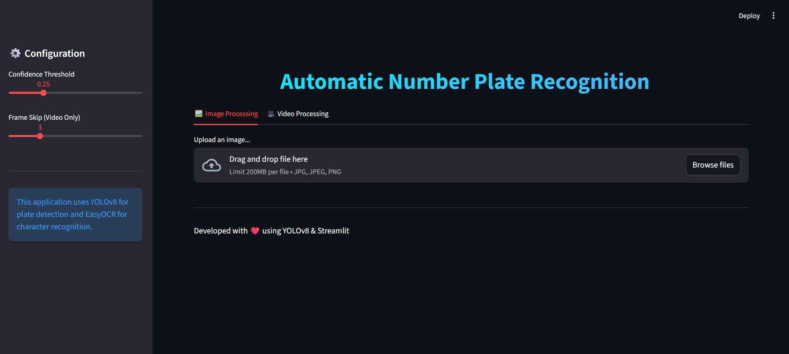
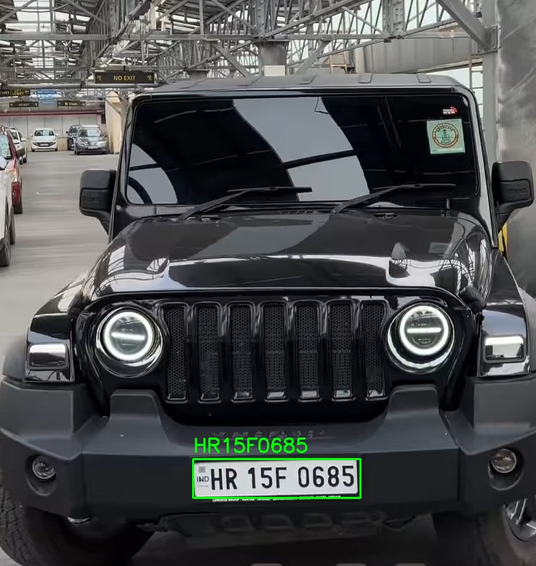
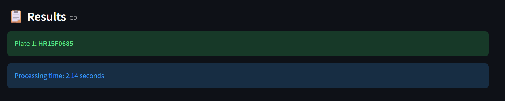
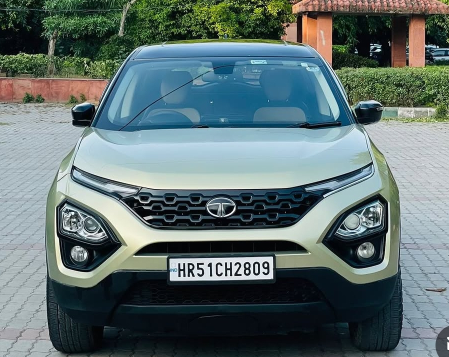
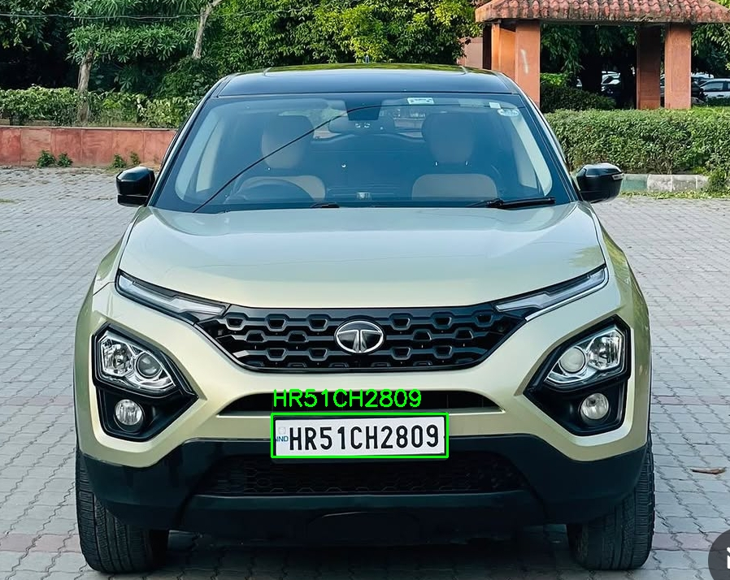
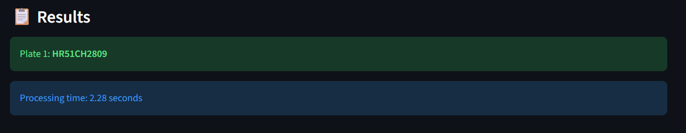

# Automatic Number Plate Detection and Recognition using YOLOv8

This project detects and recognizes vehicle number plates using YOLOv8, EasyOCR, and Streamlit.  
The system can detect vehicle number plates from uploaded images and extract the plate text accurately in real time.

The project provides a Streamlit-based web interface where users can upload images or videos and get instant number plate recognition results along with processing time.

---

# Live Demo

Website Link:  
https://numberplatedetection88.streamlit.app/

---

# Features

- Real-time Number Plate Detection  
- Number Plate Text Recognition using EasyOCR  
- Streamlit Web Interface  
- Easy to Run in VS Code  
- Supports Image and Video Detection  
- Fast and Accurate Detection using YOLOv8  
- Displays Processing Time and Recognition Results  

---

# Steps to Run the Project

## Clone the Repository

```bash
git clone https://github.com/AnujKumar/Number_Plate_Detection.git

cd Number_Plate_Detection
```

---

## Install Required Dependencies

```bash
pip install ipython scikit-image easyocr streamlit "numpy<2" -r requirements.txt
```

---

## Run the Streamlit App

```bash
streamlit run app.py
```

---

# Project Output

The following results demonstrate the working of the Automatic Number Plate Recognition System.  
The model successfully detects vehicle number plates using YOLOv8 and extracts the plate text accurately using EasyOCR.

---

## Application Interface

This is the main Streamlit interface of the application where users can upload images or videos for number plate detection and recognition.



---

## Input Vehicle Image

Original uploaded vehicle image before processing.


---

## Number Plate Detection

The system detects the number plate and highlights it using bounding boxes.



---

## Recognition Result

Final recognized number plate text generated by the system along with processing time.



---

## Second Input Vehicle Image

Another sample vehicle image provided as input.



---

## Second Number Plate Detection

Detected number plate highlighted by the YOLOv8 model.



---

## Second Recognition Result

Recognized vehicle number displayed successfully with execution time.



---

# Technologies Used

- Python  
- YOLOv8  
- EasyOCR  
- OpenCV  
- Streamlit  
- NumPy  

---

# Project Structure

```bash
Number_Plate_Detection/
│
├── app.py
├── requirements.txt
├── best.pt
├── outputs/
│   ├── A.png
│   ├── C1.jpg
│   ├── C2.jpg
│   ├── C3.png
│   ├── D1.jpg
│   ├── D2.jpg
│   └── D3.png
│
├── ultralytics/
└── README.md
```

---

# Future Improvements

- Live Camera Detection  
- Faster OCR Processing  
- Database Integration  
- Vehicle Information Tracking  
- Multi-Vehicle Detection Support  

---

